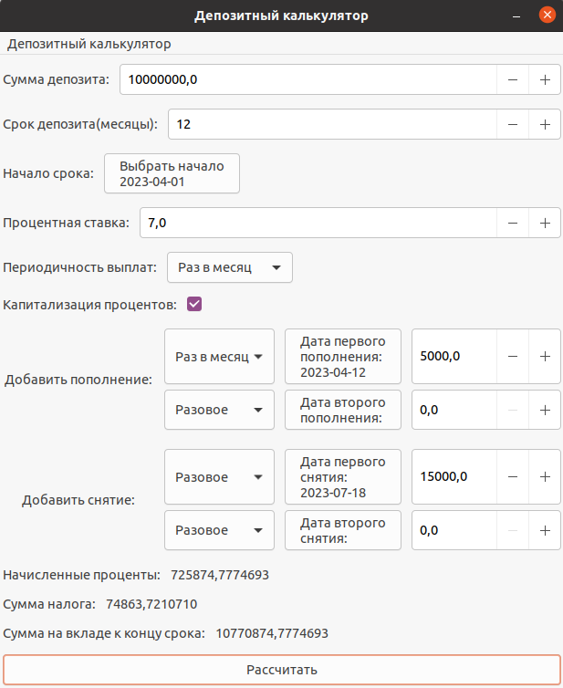

# AdvancedCalculatorGTK

Расширенная версия обычного калькулятора на языке программирования Си. Поддерживает использование переменной x и построение графика соответствующей функции. Также реализован кредитный и депозитный калькулятор.

- Реализован алгоритм Дейкстры, для преобразования выражений (в том числе функций) из инфиксной в обратную польскую нотацию и последующее вычисление. Он основан на стеке, который тоже реализован.

- Построение графика функции, заданной с помощью выражения в инфиксной нотации с переменной x  (с координатными осями, отметкой используемого масштаба и сеткой с адаптивным шагом)

- Вычисление произвольных скобочных арифметических выражений в инфиксной нотации с подстановкой значения переменной x в виде числа(для активации x есть специальная кнопка активации справа от ввода значения для x)

- Построение графика функции, заданной с помощью выражения в инфиксной нотации с переменной x  (с координатными осями, отметкой используемого масштаба и сеткой с адаптивным шагом)

- Интерфейс написан на gtk+3.0

#### Обычный режим

#### Построение графика

#### Кредитный калькулятор

#### Депозитный калькулятор

#### Выбор режима просходит через меню

### Калькулятор

#### Арифметические операторы

| Название оператора | Инфиксная нотация   (Классическая) | Префиксная нотация   (Польская нотация) |  Постфиксная нотация   (Обратная польская нотация) |
| ------ | ------ | ------ | ------ |
| Скобки | (a + b) | (+ a b) | a b + |
| Сложение | a + b | + a b | a b + |
| Вычитание | a - b | - a b | a b - |
| Умножение | a * b | * a b | a b * |
| Деление | a / b | / a b | a b \ |
| Возведение в степень | a ^ b | ^ a b | a b ^ |
| Остаток от деления | a mod b | mod a b | a b mod |
| Унарный плюс | +a | +a | a+ |
| Унарный минус | -a | -a | a- |

#### Функции

| Описание функции | Функция |   
| ---------------- | ------- |  
| Вычисляет косинус | cos(x) |   
| Вычисляет синус | sin(x) |  
| Вычисляет тангенс | tan(x) |  
| Вычисляет арккосинус | acos(x) | 
| Вычисляет арксинус | asin(x) | 
| Вычисляет арктангенс | atan(x) |
| Вычисляет квадратный корень | sqrt(x) |
| Вычисляет натуральный логарифм | ln(x) | 
| Вычисляет десятичный логарифм | log(x) |

### Кредитный калькулятор

- Вход: общая сумма кредита, срок, процентная ставка, тип (аннуитетный, дифференцированный)
- Выход: ежемесячный платеж, переплата по кредиту, общая выплата

### Депозитный калькулятор

- Вход: сумма вклада, срок размещения, процентная ставка, налоговая ставка, периодичность выплат, капитализация процентов, список пополнений, список частичных снятий
- Выход: начисленные проценты, сумма налога, сумма на вкладе к концу срока

## Сборка и тесты
  Для запуска приложения необхожимо предварительно установить библиотеку gtk+3.0

Для Ubuntu или Debian:

> sudo apt-get install libgtk-3-dev

Для Fedora:

> sudo dnf install gtk3-devel

Покрытие unit-тестами вычислительных функций c помощью библиотеки check.h, unit-тесты покрывают не менее 80% кода

Предусмотрен Makefile для сборки библиотеки и тестов (с целями all, install, uninstall, clean, dvi, dist, tests, gcov_report)

- Цель install - установит программу в папку bin

- Цель dvi - генерирует документацию в формате html

- Цель dist - создает дистрибутив для распространения

- Цель gcov_report - сформирует отчёт о покрытии кода тестами в виде html страницы
